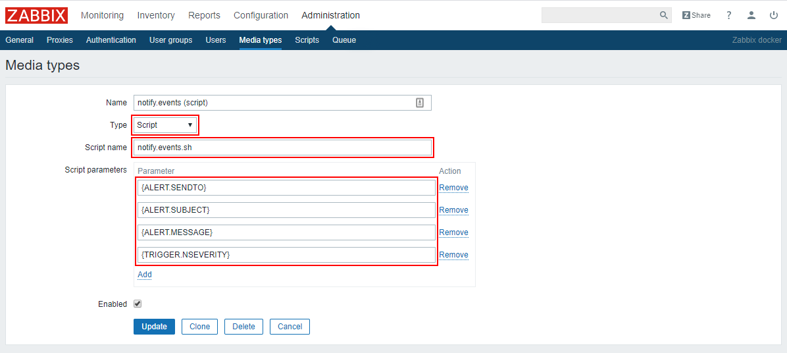

# Shell script (Zabbix 3.0 and higher)

Place the [notify.events.sh](../../script/notify.events.sh) script to the `AlertScriptPath` directory specified
in the Zabbix configuration file (for example `/usr/lib/zabbix/alertscripts/`)

Set the execute permission to this script:
```shell script
chmod +x notify.events.sh
```

Go to the "Administration" -> "Media types" section and add the following parameters to create a media-type:

```text
Type:
    Script

Script name:
    notify.events.sh

Script parameters:
    {ALERT.SENDTO}
    {ALERT.SUBJECT}
    {ALERT.MESSAGE}
    {TRIGGER.NSEVERITY}
    {TRIGGER.STATUS}
```

as you can see below:



If you have Zabbix 4.4 and higher you can upload [media-type](../../script/media-type.xml) using import.

Configure your Zabbix user according to the [instructions](user.md).
