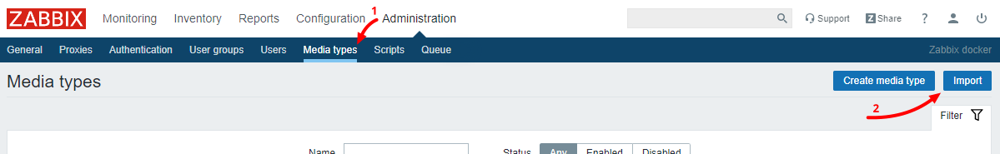
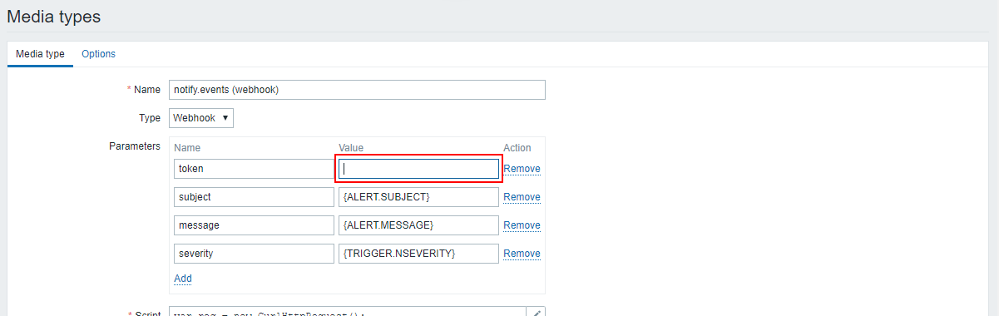
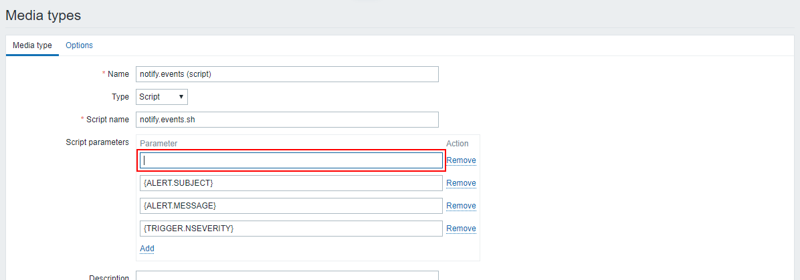

# Оповещения Zabbix в Skype, Telegram, Viber, ...

Вы можете получать уведомления из Zabbix в [поддерживаемые мессенджеры](https://notify.events/ru-RU/features) при помощи сервиса [Notify.Events](https://notify.events).

---

## Zabbix 4.4 и выше

В версии Zabbix 4.4 и выше у вас есть возможность использовать встроенный media-type с типом webhook.

Импортируйте media-type для Zabbix 4.4 и выше, для этого перейдите в раздел
"Administration" -> "Media types" и нажмите "Import":

Загрузите [media-type](../webhook/media-type.xml) и оставьте остальные параметры по умолчанию:

В Notify.Events создайте новый канал и добавьте источник "Zabbix":

После этого перейдите на страницу редактирования импортированного media-type в Zabbix и укажите токен,
полученный вами на предыдущем шаге:

Теперь вы можете использовать этот media-type для получения уведомлений в выбранные вами мессенджеры.

---

## Zabbix 1.8 и выше

Импортируйте media-type для Zabbix 1.8 и выше, для этого перейдите в раздел
"Administration" -> "Media types" и нажмите "Import":

Загрузите [media-type](../script/media-type.xml) и оставьте остальные параметры по умолчанию:

В Notify.Events создайте новый канал и добавьте источник "Zabbix":

После этого перейдите на страницу редактирования импортированного media-type в Zabbix и укажите токен,
полученный вами на предыдущем шаге:

Расположите скрипт [notify.events.sh](../script/notify.events.sh) в директории соответствующей `AlertScriptPath`,
указанному в файле конфигурации Zabbix (например `/usr/lib/zabbix/alertscripts/`)

Установите права на исполнение данному скрипту:
`chmod +x notify.events.sh`

Теперь вы можете использовать этот media-type для получения уведомлений в выбранные вами мессенджеры.
