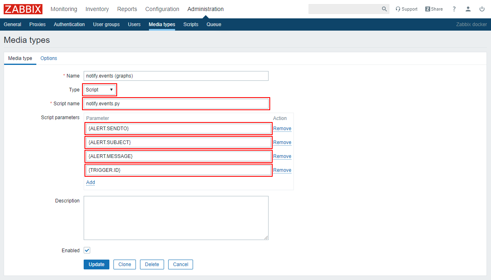

# Python script с поддержкой графиков (Zabbix 3.x и 4.x)

> Эксперементальный функционал

> К сожалению, у нас не было возможности полноценно протестировать функционал. Если у вас получилось и вы сможете
> поделиться скриншотами того, как выглядят графики, то мы вам будем очень признательны :) support@notify.events

Для работы скрипта вам потребуется установленные пакеты python3 и python3-pip.

Расположите python-скрипт [notify.events.py](../../chart/notify.events.py),
файл конфигурации [notify.events.json](../../chart/notify.events.json) и
[requirements.txt](../../chart/requirements.txt) в директории соответствующей `AlertScriptPath`,
указанному в файле конфигурации Zabbix (например `/usr/lib/zabbix/alertscripts/`)

Создайте виртуальное окружение python в каталоге со скриптами согласно [инструкции](https://docs.python.org/3/library/venv.html).

Установите необходимые зависимости:
```shell script
pip install -r requirements.txt
```

Установите права на исполнение данному скрипту:
```shell script
chmod +x notify.events.py
```

Отредактируйте файл конфигурации notify.events.json согласно вашим параметрам:
```json
{
  "zabbix": {
    "host": "http://localhost/",    - адрес zabbix-сервера
    "user": "Admin",                - имя пользователя (необходимы права на получение trigger, item, graph) 
    "password": "zabbix"            - пароль пользователя
  },
  "graph": {
    "period": 10800,                - период графика (сек)
    "width": 500,                   - ширина графика (пикс)
    "height": 250                   - высота графика (пикс)
  }
}
```

Создайте media-type, для этого перейдите в раздел "Administration" -> "Media types" и добавьте
следующие параметры:

```text
Type:
    Script

Script name:
    notify.events.py

Script parameters:
    {ALERT.SENDTO}
    {ALERT.SUBJECT}
    {ALERT.MESSAGE}
    {TRIGGER.ID}
```

как на примере ниже:



Для версии Zabbix 4.4 и выше вы можете импортировать [media-type](../../chart/media-type.xml).

Настройте вашего пользователя Zabbix согласно [инструкции](user.md).
