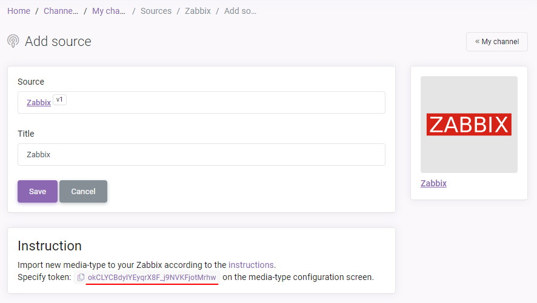
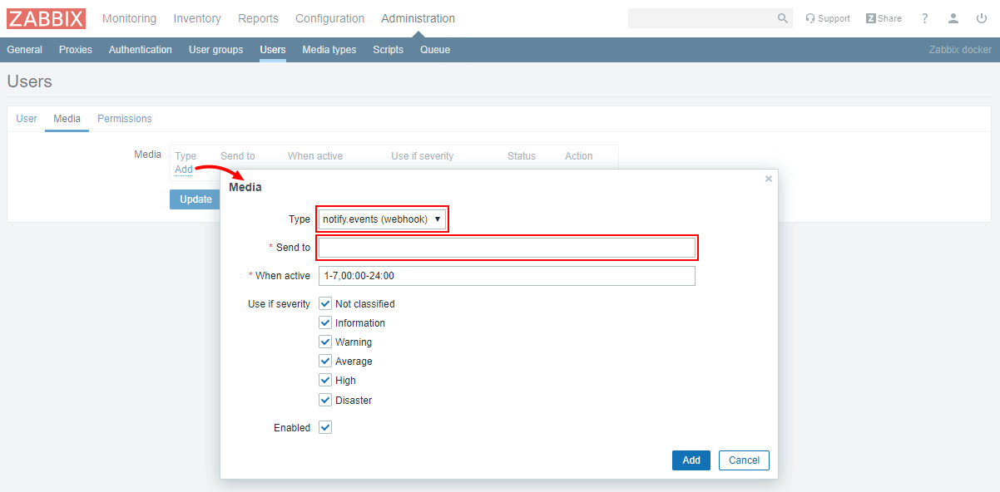
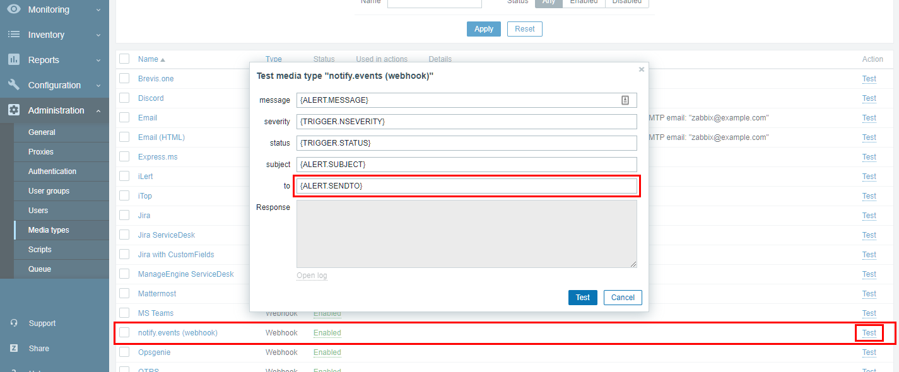

# Настройка пользователя Zabbix

В [Notify.Events](https://notify.events) создайте новый канал и добавьте источник "Zabbix":

Перейдите в настройки пользователя Zabbix и добавьте новый media. В поле "Type" выберите созданный вами
media-type и в поле "Send to" укажите ранее полученный в Notify.Events токен:

Теперь вы можете использовать Notify.Events для получения уведомлений в выбранные вами мессенджеры.

Что бы проверить отправку уведомлений из Zabbix в Notify.Events, вы можете вызвать диалоговое окно тестирования media type
в разделе "Administration" -> "Media types" -> "notify.events (webhook)" и указать полученный токен в поле "To".

