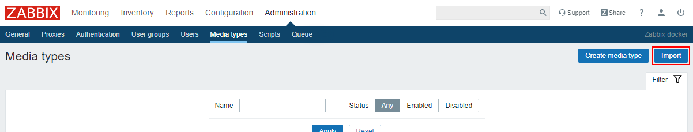

# Webhook (Zabbix 4.4 и выше)

В версии Zabbix 4.4 и выше у вас есть возможность использовать встроенный media-type с типом webhook.

Импортируйте media type. Для этого перейдите в раздел "Administration" -> "Media types" и нажмите "Import":

Загрузите [media type](../../webhook/media-type-4.4.xml) и оставьте остальные параметры по умолчанию.

Настройте вашего пользователя Zabbix согласно [инструкции](user.md).
