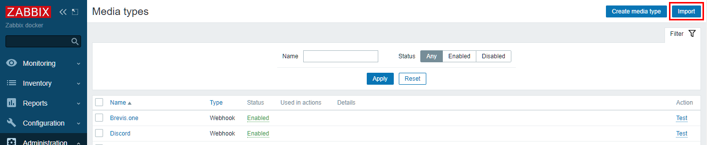

# Webhook (Zabbix 5.0 и выше)

В версии Zabbix 5.0 и выше у вас есть возможность использовать встроенный media-type с типом webhook.

Импортируйте media type. Для этого перейдите в раздел "Administration" -> "Media types" и нажмите "Import":

Загрузите [media type](../../webhook/media-type-5.0.xml) и оставьте остальные параметры по умолчанию.

Предустановленные шаблоны сообщений вы можете изменить в разделе "Message templates", отредактировав media type "notify.events (webhook)".

Настройте вашего пользователя Zabbix согласно [инструкции](user.md).
